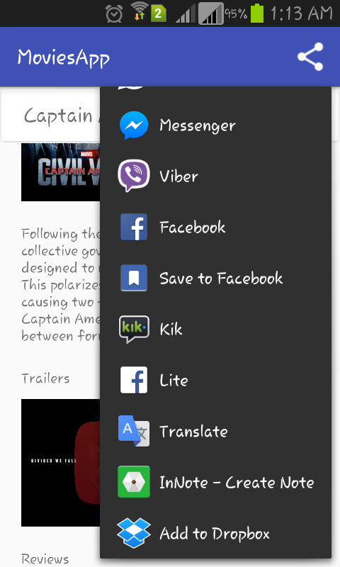
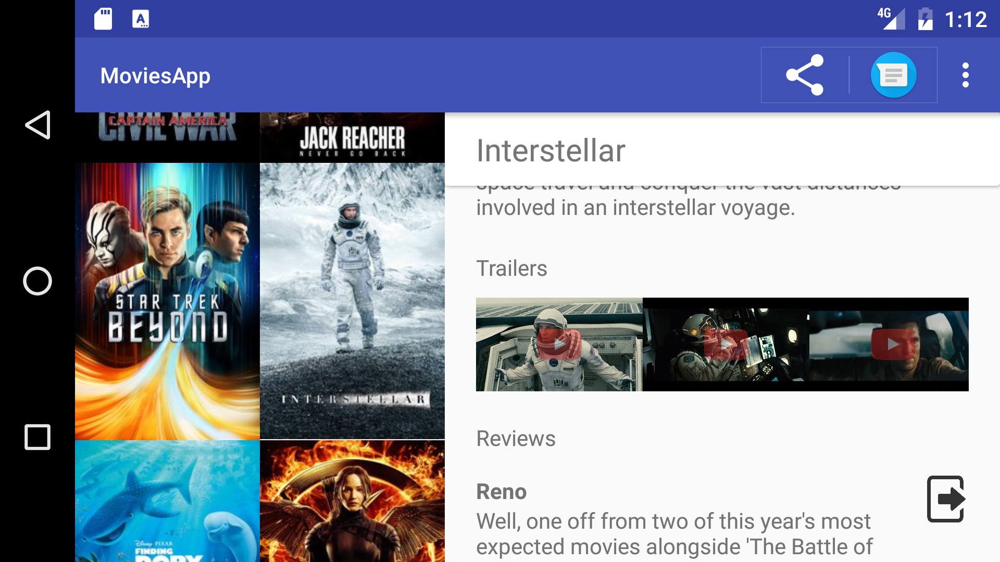

# MoviesApp
MAL - Cohort E Graduation Project
http://mobileapplaunchpad.com.eg

Developing Android Apps - Udacity course
https://classroom.udacity.com/courses/ud853ar

Overview:
- Present the user with a grid arrangement of movie posters upon launch.
- Allow your user to change sort order via a setting:
  - The sort order can be by most popular, by highest-rated or favorite movies.
  
- Allow the user to tap on a movie poster and transition to a details screen with additional information such as:
  - Original title
  - Movie poster.
  - Overview.
  - User rating.
  - Release date.

- Allow users to view and play trailers (either in the youtube app or a web browser).
- Allow users to read reviews of a selected movie.
- Allow users to mark a movie as a favorite in the details view by tapping a button(star). This is for a local movies collection that you will maintain and does not require an API request.

- The app is optimized for tablet.

Screenshots
-------------

   
  
